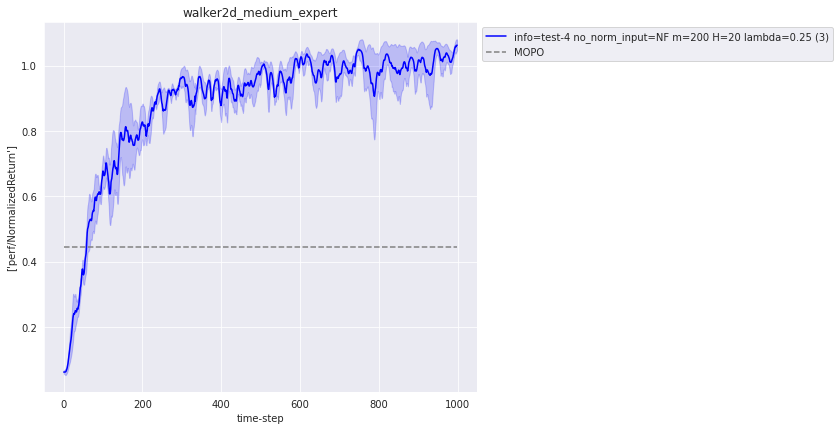

# MAPLE
The Official Code for  "[MAPLE: Offline Model-based Adaptable Policy Learning](https://proceedings.neurips.cc/paper/2021/hash/470e7a4f017a5476afb7eeb3f8b96f9b-Abstract.html)". 

After being accepted in NeurIPS'21, we conducted experiments in [NeoRL](https://arxiv.org/abs/2102.00714). The results can be found in the following table.

\* In this process, we introduced parts of implementation tricks in [the NeoRL version of MOPO](https://agit.ai/Polixir/OfflineRL/src/branch/master/offlinerl) into MAPLE, which also make the training process of MAPLE more stable in NeoRL tasks and keep (or further improve) the performance in D4RL.

[comment]: <> (The Pytorch version of MAPLE can also been found in )

# [optional] Download Resources

For better reproducibility, we uploaded a backup of dataset which is used in our experiment, since we found that the content of dataset in [D4RL](https://github.com/rail-berkeley/d4rl) and [NeoRL](https://github.com/polixir/NeoRL) might be changed.   
- D4RL: https://drive.google.com/drive/folders/1kgNg6xLHRTyb_tzDQULezB9XYGNuakCM?usp=sharing
- NeoRL: https://drive.google.com/drive/folders/1gZdVQTY_7FLCFGqszHF9sfKcXT8epoze?usp=sharing

After downloaded, you can push the data of D4RL to ~/.d4rl/datasets and NeoRL to {your path to MAPLE}/neorl_data/

We have also uploaded the dynamics models for MAPLE-200 and MAPLE-NeoRL (which have 50 ensemble models) training, which can be found in: https://drive.google.com/drive/folders/1Ex9_RyJsafKaU2Eo5UgD34ZqJnJ25cru?usp=sharing.
You can download the models to {path to MAPLE}/models to skip the dynamics model training process. 

# Installation

We use [RLAssistant](https://github.com/xionghuichen/RLAssistant) to manage our experiments. You can download and install it via:
```
git clone https://github.com/xionghuichen/RLAssistant.git
cd RLAssistant
pip install -e .
```
Then you can install MAPLE via:
```
git clone https://github.com/xionghuichen/MAPLE.git
cd RLAssistant
pip install -e .
```

# Quick Start

You can train your MAPLE policy directly like this:
```
cd run_scripts
# train the MAPLE policy for the hopper_low task in neorl
python main.py --config examples.config.neorl.hopper_low
or 

# train the MAPLE policy for walker2d_medium_expert task in d4rl
python main.py --config examples.config.d4rl.walker2d_medium_expert 

# train the MAPLE policy for walker2d_medium_expert task in d4rl with 200 dynamics models
python main.py --config examples.config.d4rl.walker2d_medium_expert --maple_200


# train the MAPLE policy for walker2d_medium_expert task in d4rl with your custom configs
python main.py --config examples.config.d4rl.walker2d_medium_expert --custom_config --penalty_coeff 1.0
```

The training logs can be found in {your MAPLE path}/log. You can use tensorbard to check and also use the tools in RLA to visualize (e.g., ```RLA.easy_plot.plot_func.plot_res_func```).
You can check plot_demo.ipynb for more details. The figure of the simplest setting will be something like this:

There are also some scrips in ``./rla_scrips`` to manage the experimental logs. 
